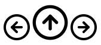

# yew_icons

This crate makes it easy to use SVG icons from the following collection (more may be added in the future):

- [Feather](https://feathericons.com/) - MIT License
- [Font Awesome](https://fontawesome.com/icons) - CC BY 4.0 License
- [Octicons](https://primer.style/octicons/) - MIT License

## Usage

```toml
[dependencies]
yew_icons = {path = "..", features = ["FeatherArrowLeftCircle", "FeatherArrowRightCircle", "FeatherArrowUpCircle"]}
```

```rust
use yew::prelude::*;
use yew_icons::{Icon, IconId};

html!{
    <>
        <Icon icon_id={IconId::FeatherArrowLeftCircle}/>
        <Icon icon_id={IconId::FeatherArrowUpCircle} width={"2em".to_owned()} height={"2em".to_owned()}/>
        <Icon icon_id={IconId::FeatherArrowRightCircle} onclick={Callback::from(|_: MouseEvent| {})}/>
    </>
}
```



Note: The icons will inherit their parent's CSS `color`.

## Feature Flags

Each icon collection must be included with the corresponding feature flag, such as `feather` or `font_awesome_solid`.

To save binary size, individual icons can also be included by feature flag, such as `FeatherZoomIn` or `FontAwesomeSolidAtom`.

By default, no collections or icons are included. Be warned that including too many icons may result in a `.wasm` binary
that some WebAssembly engines refuse to load (see https://github.com/rustwasm/wasm-pack/issues/981).

## License

Code is licensed under either of

 * Apache License, Version 2.0
   ([LICENSE-APACHE](LICENSE-APACHE) or http://www.apache.org/licenses/LICENSE-2.0)
 * MIT license
   ([LICENSE-MIT](LICENSE-MIT) or http://opensource.org/licenses/MIT)

at your option.

Icons are licensed by their respective creators (see above). An license summary is emitted to the DOM for each icon:
```html
<svg data-license="...original license...">
```

## Contribution

Unless you explicitly state otherwise, any contribution intentionally submitted
for inclusion in the work by you, as defined in the Apache-2.0 license, shall be
dual licensed as above, without any additional terms or conditions.