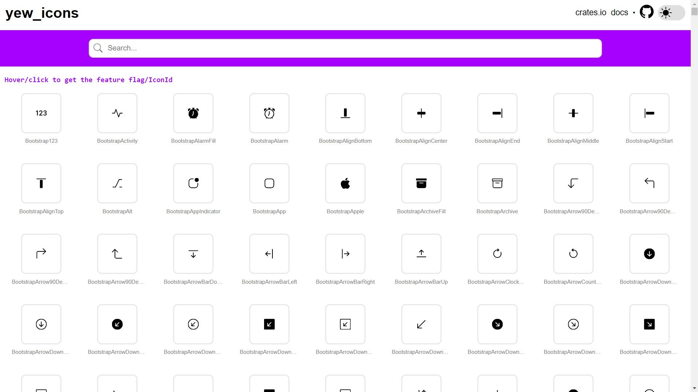

# yew_icons

[![Icons Gallery]][gallery] [![Latest Version]][crates.io]

[icons gallery]: https://img.shields.io/badge/gallery-passing-brightgreen
[gallery]: https://finnbear.github.io/yew_icons/
[latest version]: https://img.shields.io/crates/v/yew_icons.svg
[crates.io]: https://crates.io/crates/yew_icons

This crate makes it easy to use [SVG icons](https://finnbear.github.io/yew_icons/) from the following collections (more may be added in the future):

| Icon Set             | License           | Variants                   |
| -------------------- | ----------------- | -------------------------- |
| **Bootstrap**        | MIT License       | -                          |
| **Feather**          | MIT License       | Deprecated (use Lucide)    |
| **Font Awesome**     | CC BY 4.0 License | Regular, Solid             |
| **Heroicons**        | MIT License       | Solid, Outline, Mini Solid |
| **Lipis Flag Icons** | MIT License       | -                          |
| **Lucide**           | ISC License       | -                          |
| **Octicons**         | MIT License       | -                          |
| **Simple Icons**     | CC0 License       | -                          |

## Gallery

[](https://finnbear.github.io/yew_icons/)

<small>\*not all icons included in [gallery](https://finnbear.github.io/yew_icons/).</small>

## Usage

Use the [gallery](https://finnbear.github.io/yew_icons/) to find icons you like, and add them as feature flags.

```toml
# If still using yew 0.19, use yew_icons 0.6.1

[dependencies]
yew_icons = {version = "0.7", features = ["LucideArrowLeftCircle", "LucideArrowRightCircle", "LucideArrowUpCircle"]}
```

Then, add an `<Icon>` component with the corresponding icon id, optionally specifying a `width`, `height`, and/or `onclick` callback.

```rust
use yew::prelude::*;
use yew_icons::{Icon, IconId};

html!{
    <>
        <Icon icon_id={IconId::LucideArrowLeftCircle}/>
        <Icon icon_id={IconId::LucideArrowUpCircle} width={"2em".to_owned()} height={"2em".to_owned()}/>
        <Icon icon_id={IconId::LucideArrowRightCircle} onclick={Callback::from(|_: MouseEvent| {})}/>
    </>
}
```


Note: The icons will inherit their parent's CSS `color`.

## Feature Flags

Each icon collection must be included with the corresponding feature flag, such as `lucide` or `font_awesome_solid`.

To save binary size, individual icons can also be included by feature flag, such as `LucideZoomIn` or `FontAwesomeSolidAtom`.

By default, no collections or icons are included. Be warned that including too many icons may result in a `.wasm` binary
that some WebAssembly engines refuse to load, especially in debug mode (see <https://github.com/rustwasm/wasm-pack/issues/981>).

## License

Code is licensed under either of

- Apache License, Version 2.0
  ([LICENSE-APACHE](LICENSE-APACHE) or <http://www.apache.org/licenses/LICENSE-2.0>)
- MIT license
  ([LICENSE-MIT](LICENSE-MIT) or <http://opensource.org/licenses/MIT>)

at your option.

Icons are licensed by their respective creators (see above). An license summary is emitted to the DOM for each icon:

```html
<svg data-license="...original license..."></svg>
```

## Contribution

Unless you explicitly state otherwise, any contribution intentionally submitted
for inclusion in the work by you, as defined in the Apache-2.0 license, shall be
dual licensed as above, without any additional terms or conditions.

### Updating an Icon Collection

```
# 1. on first checkout, init submodules:
git submodule update --init --recursive

# 2. update a submodule to latest commit in remote branch:
git submodule update --remote bootstrap

# 3. generate the icons, writing the feature flags to a file:
cargo run --features="generator" > generated_feature_flags.txt

# 4. reformat the feature flags onto separate lines (choose your own adventure, e.g. vim macros)

# 5. copy the feature flags from generated_feature_flags.txt to the Cargo.toml
```
